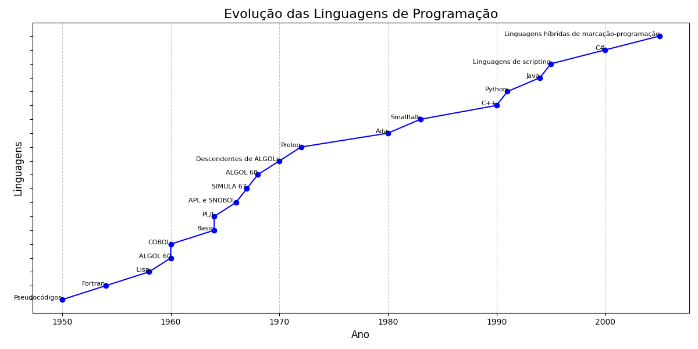

# Introdução às Linguagens de Programação

**1. Introdução às Linguagens de Programação**

**EVOLUÇÃO DAS PRINCIPAIS LINGUAGENS DE PROGRAMAÇÃO**

**Gráfico plotado em Python, referência : Conceitos de Linguagens de Programação de Robert W. Sebesta (cap. 02)**

    O gráfico gerado em Python com a biblioteca matplotlib ilustra a evolução das linguagens de programação desde a década de 1950 até os dias atuais. Observa-se uma transição de representações rudimentares, como pseudocódigos, para linguagens cada vez mais compreensíveis e próximas da linguagem humana. É importante ressaltar que o gráfico não contempla todas as linguagens existentes nem suas versões posteriores, limitando-se a indicar seus marcos iniciais.

    Embora não representada na imagem, vale destacar a linguagem Plankalkül, desenvolvida por Konrad Zuse entre 1936 a 1945. Apesar de não implementada na prática, sua sofisticação contribuiu para o entendimento da evolução sintático-semântica das linguagens.

    Os pseudocódigos da década de 1950 não correspondem à definição moderna do termo, sendo necessário desvincular suas interpretações temporais. Em 1954, surge o Fortran, a primeira linguagem científica, com paradigma imperativo. Entre 1958 e 1968, destacam-se linguagens fundamentais como Lisp (programação funcional e manipulação de listas), Algol 60 (estruturação de programas), Cobol (aplicações comerciais com sintaxe próxima à linguagem natural), Basic (popularização da programação), PL/I (integração entre ciência e negócios), APL (notação matemática concisa), Snobol (manipulação de cadeias), Simula 67 (fundamentos da orientação a objetos) e Algol 68 (tipos de dados avançados).

    Entre 1970 e 1990, surgem linguagens como Pascal e Modula-2 (descendentes de Algol com forte tipagem), Prolog (programação lógica e IA), Ada (segurança e modularidade para sistemas críticos), Smalltalk (ambientes interativos e OO), e C++ (eficiência com orientação a objetos).

    De 1991 aos anos 2000, surgem linguagens que ampliam o escopo da programação: Python (simplicidade e versatilidade), Java (portabilidade e robustez), JavaScript e PHP (scripting voltado à web), C# (produtividade com base no C++ e Java), além de linguagens híbridas como HTML+JavaScript e XML+XSLT, que integram estrutura e processamento dinâmico.
